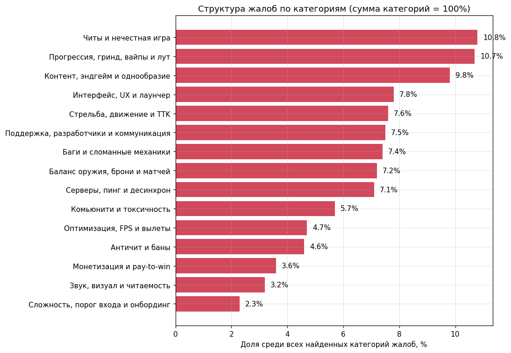
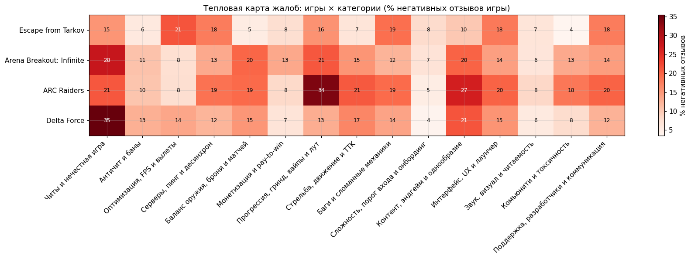

# Анализ негативных отзывов Steam

Смотрел негативные отзывы по четырём extraction-шутерам: на что чаще всего
жалуются, чем жанр «болит» и как это менялось по месяцам.

Данные сняты 12.07.2026. В репозитории — агрегаты, графики и ноутбук.
Полные тексты отзывов сюда не выкладывал.

## Игры

| Игра | App ID | Разработчик |
|---|---|---|
| Escape from Tarkov | 3932890 | Battlestate Games |
| Arena Breakout: Infinite | 2073620 | Morefun Studios |
| ARC Raiders | 1808500 | Embark Studios |
| Delta Force | 2507950 | TiMi Studio Group |

## Что внутри

- `steam_reviews_analysis.ipynb` — весь пайплайн
- `output/` — сводные таблицы
- `output/charts/` — картинки
- `output/negative_analysis_summary.md` — короткий итог
- `METHODOLOGY.md` — откуда данные и где у метода слабые места

## Запуск

```bash
pip install -r requirements.txt
jupyter notebook
```

Открыть ноутбук и прогнать сверху вниз. Если не хочется тянуть всю историю,
поставьте число в `MAX_NEGATIVE_REVIEWS_PER_GAME`. `None` = качать до конца,
это долго.

Сырые отзывы при повторном запуске могут лечь в `output/raw_negative/` —
эта папка в `.gitignore`.

## Результаты





Подробнее про ограничения keyword-разметки — в [METHODOLOGY.md](METHODOLOGY.md).
